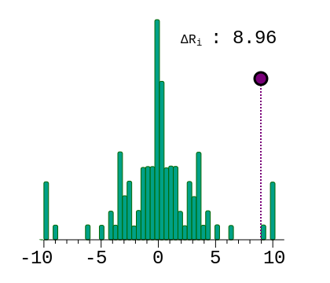

.. _rstdelta:

==============
Delta Ri Score
==============

The individual sequence information of a sequence and an alternate sequence are showing
using the Sequence Walker (see :ref:`rstwalker`). This graphic shows the value of the
difference between the reference sequence and an alternate sequence as well as the
distribution of random changes to sequences of the same length. A variant that reduces
the sequence information is associated with a positive delta-Ri score.

   Delta graphic for a +1 donor variant.

Creating Delta Plots with vmvt
~~~~~~~~~~~~~~~~~~~~~~~~~~~~~~

The following code creates a delta plot. Note that the input Strings must be
9 nucleotides long. Vmvt will treat the string as corresponding to positions (-3,+6) of
the intron-exon boundary of a splice donor sequence. Sequences can be provided
in upper or lower case.

  .. code-block:: java

    import org.monarchinitiative.vmvt.core;

    final String ref = "AAGGTCAGA";
    final String alt = "AAGATCAGA";

    VmvtGenerator vmvt = new VmvtGenerator();
    String svg = vmvt.getDelta(ref,alt);

The command works for both donor and acceptor sequences (the code figures out if the
sequences passed to it are donor sequences (i.e., 9 nt) or acceptor sequences (i.e., 27 nt).
