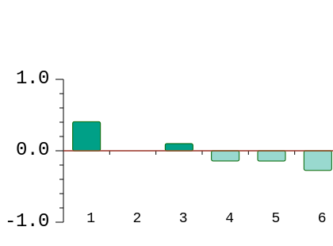
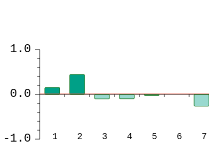

.. _rstese:

======================================
Illustrating Exonic Splicing Enhancers
======================================

Exons may contain splicing regulatory elements (ESRs),
such as exonic splicing enhancers (ESEs) and exonic splicing silencers (ESSs).
ESEs and ESSs usually correspond to 6–8 nucleotide stretches that serve as binding sites
for splicing activator or splicing repressor proteins. Variants that occur in
ESEs or ESSs can cause splicing defects such as exon skipping
(`PLoS Genet 2016;12:e1005756 <https://pubmed.ncbi.nlm.nih.gov/26761715/>`_).

Hexamer analysis
~~~~~~~~~~~~~~~~

In 2011, Shengdong Ke and colleagues investigated a complete set of RNA 6-mer sequences (hexamers) by deep sequencing
successfully spliced transcripts. All 4096 6-mers were substituted at five positions within
two different internal exons in a 3-exon minigene, and millions of successfully spliced transcripts
were sequenced after transfection of human cells and the splicing effect of each 6-mer could be quantified
(`Genome Res 2011;21:1360-74 <https://pubmed.ncbi.nlm.nih.gov/21659425/>`_).

Daniela Di Giacomo and colleagues leveraged these hexamer scores to investigate candidate disease-associated variants by
summing the the exonic splicing regulator sequence scores (ESRseq Scores) of the  hexamers that overlap
the variant position for the the reference sequence (ESRseq WT) and the alternate sequence (ESRseq VAR)
and then calculating the change in total ESRseq score (i.e., ESRseq VAR minus ESRseq WT). The authors
showed that experimental data had high sensitivity in detecting variants that increased exon
skipping (`Hum Mutat 2013;34:1547-57 <https://pubmed.ncbi.nlm.nih.gov/23983145/>`_), a finding
that was confirm by Omar Soukarieh and colleagues, who terms this score ΔtESRseq
(`PLoS Genet 2016;12:e1005756 <https://pubmed.ncbi.nlm.nih.gov/26761715/>`_). For simplicity, we will
refer to this score as ΔESR.

In the following example, we show a synonymous variant in exon 39 of FBN1 (NM_000138.4:c.4773A>C) that
was shown to causes Exon Skipping and to be associated with Marfan syndrome
(`Li et al., 2020 <https://pubmed.ncbi.nlm.nih.gov/32562828/>`_). The variant is associated
with a ΔtESR of 0.22. The following graphic shows how the score was calculated from the
ESRseq of the six hexamers that overlap with the variant.

   Hexamer graphic for the variant NM_000138.4:c.4773A>C.

Creating Hexamer Plots with vmvt
~~~~~~~~~~~~~~~~~~~~~~~~~~~~~~~~

The following code creates a hexamer plot. Note that the input Strings must be
11 nucleotides long for SNVs, whith the variant being at the middle position.
Sequences can be provided in upper or lower case.

  .. code-block:: java

    import org.monarchinitiative.vmvt.core;

    String ref = "CCTGGAGGGGA";
    String alt = "CCTGGCGGGGA";
    VmvtGenerator vmvt = new VmvtGenerator();
    String svg = vmvt.getHexamerSvg(ref, alt);

Heptamer analysis
~~~~~~~~~~~~~~~~~
In 2018, Shengdong Ke performed an analysis of 7-mer sequences (heptamers),
whereby each 7-mer was assigned a normalized z-score as a measure of affinity relative
to the mean of all 7-mers
(`Genome Res 2018;28:11-24 <https://pubmed.ncbi.nlm.nih.gov/29242188/>`_). The following figure
shows an analogous analysis of NM_000138.4:c.4773A>C.

   Heptamer graphic for the variant NM_000138.4:c.4773A>C.

