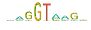

.. _rstlogo:

==============
Sequence Logos
==============

In 1990, Tom Schneider introduced Sequence logos as a way of graphically displaying consensus sequences.
The characters representing the sequence are stacked on top of each other for each position in the
aligned sequences. The height of each letter is made proportional to its frequency, and the letters
are sorted so the most common one is on top. The height of the entire stack is then adjusted to signify
the information content of the sequences at that position. From these 'sequence logos', one can
determine not only the consensus sequence but also the relative frequency of bases and the information
content (measured in bits) at every position in a site or sequence. The logo displays both significant
residues and subtle sequence patterns
(`Nucleic Acids Res 1990;18:6097-100 <https://pubmed.ncbi.nlm.nih.gov/2172928/>`_).

   Sequence Logo graphic for a donor variant.

Creating Sequence Logos with vmvt
~~~~~~~~~~~~~~~~~~~~~~~~~~~~~~~~~

The following code creates a splice donor Logo.

  .. code-block:: java

    import org.monarchinitiative.vmvt.core;

    VmvtGenerator vmvt = new VmvtGenerator();
    String donor = vmvt.getDonorLogoSvg();

A splice acceptor logo is created as follows.

  .. code-block:: java

    import org.monarchinitiative.vmvt.core;

    VmvtGenerator vmvt = new VmvtGenerator();
    String donor = vmvt.getAcceptorLogoSvg();