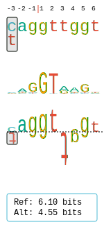
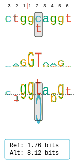

.. _rstritrekker:

=========================
Sequence trekkers with Ri
=========================

This graphic can be used to illustrate the effects of a variant that simultaneously creates a cryptic splice
site and also weakens the canonical splice site. Please see :ref:`rsttrekker` for information about the Trekker.

Consider the variant NM_000518.5(HBB):c.90C>T (p.Gly30=). This variant is listed as Pathogenic in Clinvar
(`VCV000038682.2 <https://www.ncbi.nlm.nih.gov/clinvar/variation/38682/>`_),
and may create a novel 5' splicing donor site and a frameshift change. The variant is located at the -3 position of
the donor site of exon 1 of the hemoglobin beta (HBB) gene. The variant is related to beta Thalassemia.

VMVT models the donor site as a 9 nucleotide sequence made up of the last three bases of the upstream exon and the first
6 bases of the following intron. The above variant (shown in brackets) affects the very first base of the canonical
(wildtype) donor sequence: ::

    [C/T]AG|GTTGGT

The variant creates a novel (cryptic) splice site three bases upstream, shifting the reading frame: ::

    CTG|G[C/T]AGGT

To represent both changes with VMVT, use the following code. The corresponding SVG graphics are shown beneath the Java
code.

1. Canonical donor site

  .. code-block:: java

    import org.monarchinitiative.vmvt.core;

    final String ref = "CAGGTTGGT";
    final String alt = "TAGGTTGGT";

    VmvtGenerator vmvt = new VmvtGenerator();
    String svg = vmvt.getDonorWithRi(ref, alt);

   Sequence Trekker graphic for NM_000518.5(HBB):c.90C>T.

1. Canonical donor site

  .. code-block:: java

    import org.monarchinitiative.vmvt.core;

    final String ref2 = "CTGGCAGGT";
    final String alt2 = "CTGGTAGGT";
    vmvt = new VmvtGenerator();
    svg = vmvt.getDonorWithRi(ref2, alt2);

   Sequence Trekker graphic showing a cryptic splice site created by NM_000518.5(HBB):c.90C>T.

