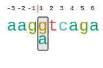

.. _rstruler:
===============
Sequence rulers
===============

Sequence rulers are SVG graphics that show the sequence
of the donor or acceptor site, mark the intron-exon
boundary, and show the position of any alternate
bases that diverge from the reference sequence.

   Sequence ruler graphic for a donor variant.

Creating Sequence Rulers with vmvt
~~~~~~~~~~~~~~~~~~~~~~~~~~~~~~~~~~

The following code creates a splice donor ruler. Note that the input Strings must be
9 nucleotides long. Vmvt will treat the string as corresponding to positions (-3,+6) of
the intron-exon boundary of a splice donor sequence. Sequences can be provided in upper or lower case.

  .. code-block:: java

    import org.monarchinitiative.vmvt.core;

    final String ref = "AAGGTCAGA";
    final String alt = "AAGATCAGA";

    VmvtGenerator vmvt = new VmvtGenerator();
    String svg = vmvt.getDonorSequenceRuler(ref,alt);

The acceptor version is created analogously with the ``getAcceptorSequenceRuler`` command.