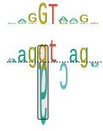

.. _rsttrekker:

=================
Sequence trekkers
=================

We combine the sequence logo (see :ref:`rstlogo`) and walker (see :ref:`rstwalker`) in a new figure
that we call sequence trekker (because a trek goes further than a walk).

   Sequence Trekker graphic for a +1G>A donor variant.

Creating Sequence Trekkers with vmvt
~~~~~~~~~~~~~~~~~~~~~~~~~~~~~~~~~~~~

The following code creates a splice donor walker. Note that the input Strings must be
9 nucleotides long. Vmvt will treat the string as corresponding to positions (-3,+6) of
the intron-exon boundary of a splice donor sequence. Sequences can be provided in upper or lower case.

  .. code-block:: java

    import org.monarchinitiative.vmvt.core;

    final String ref = "AAGGTCAGA";
    final String alt = "AAGATCAGA";

    VmvtGenerator vmvt = new VmvtGenerator();
    String svg = vmvt.getDonorTrekkerSvg(ref,alt);
