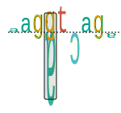

.. _rstwalker:

================
Sequence walkers
================

Tom Schneider introduced Sequence Walkers in 1995 as a  way of graphically displaying how
binding proteins and other macromolecules interact with individual bases of nucleotide sequences. Characters
representing the sequence are either oriented normally and placed above a line indicating favorable
contact, or upside-down and placed below the line indicating unfavorable contact. The positive or
negative height of each letter shows the contribution of that base to the average sequence conservation
of the binding site, as represented by a sequence logo
(`Nucleic Acids Res 1997;25:4408-15 <https://pubmed.ncbi.nlm.nih.gov/9336476/>`_). In 1998, Peter Rogan
introduced the application of individual information content and Sequence Walkers to splicing variants
(`Hum Mutat 1998;12:153-71 <https://pubmed.ncbi.nlm.nih.gov/9711873/>`_).

Our version of the sequence walker combines the reference and the alternate sequence. The positions in
which the alternate differs from the reference are indicated by a grey box and both nucleotides are shown.
In many disease-associated variants, the reference base will be position upright and the alternate base
will be positioned
beneath the line.

   Sequence Walker graphic for a +1G>A donor variant.

Creating Sequence Walkers with vmvt
~~~~~~~~~~~~~~~~~~~~~~~~~~~~~~~~~~~

The following code creates a splice donor walker. Note that the input Strings must be
9 nucleotides long. Vmvt will treat the string as corresponding to positions (-3,+6) of
the intron-exon boundary of a splice donor sequence. Sequences can be provided in upper or lower case.

  .. code-block:: java

    import org.monarchinitiative.vmvt.core;

    final String ref = "AAGGTCAGA";
    final String alt = "AAGATCAGA";

    VmvtGenerator vmvt = new VmvtGenerator();
    String svg = vmvt.getDonorWalkerSvg(ref,alt);

A splice acceptor walker is created as follows. Input Strings must be 27 nucleotides long.

   Sequence Walker graphic for a +1G>A Acceptor variant.

Vmvt will treat the string as corresponding to positions (-25,+2) of
the intron-exon boundary of a splice acceptor sequence.
Sequences can be provided in upper or lower case.

  .. code-block:: java

    import org.monarchinitiative.vmvt.core;

    final String ref = "cctggctggcggcaccgggtgccagGT";
    /** chr10-90768644-A-G, -2 position */
    final String alt = "cctggctggcggcaccgggtgccggGT";
    VmvtGenerator vmvt = new VmvtGenerator();
    String svg = vmvt.getAcceptorWalkerSvg(ref,alt);

